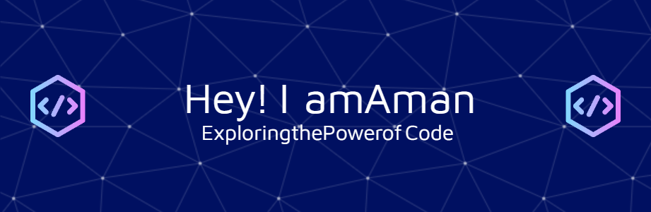

# Hi there, I'm Aman Galoliya! ✨

Welcome to my GitHub profile! I'm a passionate IT student specializing in **Backend Engineering**, **DevOps**, and **Cloud Solutions**. I thrive on building scalable, innovative applications leveraging cutting-edge technologies like **Node.js**, **Docker**, and **AWS**. Let's connect and create something amazing together! 🚀

 <!-- Replace this with your custom banner image -->

## About Me
- 🎓 **Bachelor of Engineering (IT)** at L.D. College of Engineering, CPI: 9.03
- 💻 Backend enthusiast with a knack for solving complex problems.
- 🌟 Skilled in building **machine learning integrations**, **serverless applications**, and **DevOps pipelines**.
- 📍 Based in Ahmedabad, India.

---

## 🚀 Projects

---

## 💻 Technical Skills

### Languages

### Frameworks & Libraries

### Databases

### DevOps Tools

### Version Control

---

## 🏆 Achievements
- **Winner**: HackOut'24 at DAIICT for developing an AI-powered agricultural app.
- **Qualified**: GTU's **Smart India Hackathon 2023** and 2024.
- **Certified**: Career Essentials Course by Microsoft.

---

## 🤝 Collaboration
I'm always open to collaborating on exciting **open-source projects**, **hackathons**, and **DevOps pipelines**. Feel free to reach out!

---

## 🌟 GitHub Activity
 <!-- Replace `username` -->

---

## 📫 Contact Me
- **Email**: 22itgal025@ldce.ac.in
- **LinkedIn**: [Aman Galoliya](https://www.linkedin.com/in/aman-galoliya/) <!-- Replace with actual LinkedIn link -->
- **GitHub**: [Amankumar-G](https://github.com/Amankumar-G) <!-- Replace with actual GitHub username -->

---

Thank you for visiting my profile! 😊 Let's connect and innovate together!
